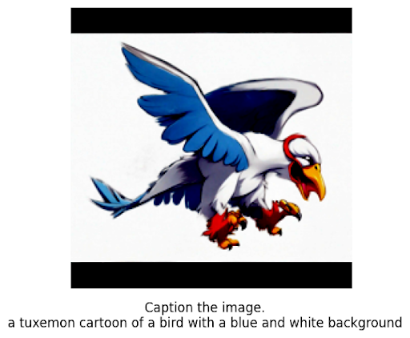

# Fine Tuning PaliGemma

## What is PaliGemma?

PaliGemma 2 and PaliGemma are lightweight open vision-language models (VLM) inspired by PaLI-3, and based on open components like the [SigLIP](https://arxiv.org/abs/2303.15343) vision model and the [Gemma language model](https://arxiv.org/abs/2403.08295). PaliGemma takes both images and text as inputs and can answer questions about images with detail and context, meaning that PaliGemma can perform deeper analysis of images and provide useful insights, such as captioning for images and short videos, object detection, and reading text embedded within images.

> [!Note]
We have a blog covering SigLIP in depth please have a look if you're interested:
[Choosing Between SigLIP and CLIP for Language Image Pretraining](https://blog.ritwikraha.dev/choosing-between-siglip-and-clip-for-language-image-pretraining)

Google has released three types of PaliGemma models:
1. Pretrained (pt) models: Trained on large datasets without task-specific tuning.
2. Mix models: A combination of pre-trained and fine-tuned elements.
3. Fine-tuned (ft) models: Research-oriented models that are fine-tuned on specific research datasets.

## Model Access
PaliGemma 2 is available in 3B, 10B, and 28B parameter sizes which are based on Gemma 2 2B, 9B, and 27B models, respectively. Model variants support different pixel resolutions for image inputs, including 224 x 224, 448 x 448, and 896 x 896 pixels.

All the model variants can be accessed from the HuggingFace page and are already integrated with the Transformers🤗 library. 

Hugging Face🤗 model hub page : [PaliGemma 2 Release: Vision-Language Models available in multiple 3B, 10B and 28B variants.](https://huggingface.co/collections/google/paligemma-2-release-67500e1e1dbfdd4dee27ba48)

## Fine-Tuning Methods

- Using JAX: [JAX Fine-Tuning Script](https://colab.research.google.com/github/google-research/big_vision/blob/main/big_vision/configs/proj/paligemma/finetune_paligemma.ipynb)
- Using HuggingFace Transformers: [Fine-tuning with Trainer🤗](https://huggingface.co/blog/paligemma#using-transformers-1)
- With PyTorch:
  + For Object detection problems: `object_detection_ft.py`
  + For General fine-tuning: `vanilla_ft.py` 

# Results
We fine-tuned the model on two tasks: Image Captioning and Object detection. We also tuned the model on a specific task of "counting intersections" between lines inspired from [VLMs are blind](https://vlmsareblind.github.io/) paper. Check the corresponding code and dataset in the `count_intersection` folder.
## Image Captioning

For image captioning task we chose the [`tuxemon`](https://huggingface.co/datasets/diffusers/tuxemon) dataset which contains tuxemons, a spin-off of pokemons and their captions as descriptions.

### Fine Tuning comparison

| Before Fine Tuning | After Fine Tuning |
|---|---|
|  |  |

## Object Detection
For object detection, the dataset has to be preprocessed in a way to be compatible with the model. The [Big vision space](https://huggingface.co/spaces/big-vision/paligemma) gives us some valuable insights on how to do so. So we made a script 
to format any object detection dataset to the format compatible with PaliGemma. 

### A note on the data format: 
The format is to put the prefix and suffix in a specific way. In the prefix, use the keyword `detect` followed by a semicolon-separated list of the object classes you want to detect. For example, `detect {object} ; {object}`. The suffix should contain the detection results, with each object represented by its bounding box and class name. The bounding box is formatted as `<loc{Y1}><loc{X1}><loc{Y2}><loc{X2}>`, where X1, Y1, X2, and Y2 are the normalized coordinates of the top-left and bottom-right corners of the box, respectively.

You can find the function to format any object detection dataset to Paligemma format here: `create_od_dataset.py`

Fine-tuning script for object detection task:  `object_detection_ft.py`

### Fine-Tuning comparison

| Before Fine Tuning | After Fine Tuning |
|---|---|
|  |  |

## Further Resources
- [Understanding PaliGemma](https://blog.ritwikraha.dev/understanding-paligemma-in-50-minutes-or-less)
- [Choosing Between SigLIP and CLIP for Language Image Pretraining](https://blog.ritwikraha.dev/choosing-between-siglip-and-clip-for-language-image-pretraining)
- [PaliGemma prompt and system instructions](https://ai.google.dev/gemma/docs/paligemma/prompt-system-instructions)

## Citations 

1. Steiner, A., Pinto, A. S., Tschannen, M., Keysers, D., Wang, X., Bitton, Y., Gritsenko, A., Minderer, M., Sherbondy, A., Long, S., Qin, S., Ingle, R., Bugliarello, E., Kazemzadeh, S., Mesnard, T., Alabdulmohsin, I., Beyer, L., & Zhai, X. (2024). **PaliGemma 2: A Family of Versatile VLMs for Transfer**. ArXiv. https://arxiv.org/abs/2412.03555
2. Rahmanzadehgervi, P., Bolton, L., Taesiri, M. R., & Nguyen, A. T. (2024). **Vision language models are blind**. ArXiv. https://arxiv.org/abs/2407.06581
3. Zhai, X., Mustafa, B., Kolesnikov, A., & Beyer, L. (2023). **Sigmoid Loss for Language Image Pre-Training**. ArXiv. https://arxiv.org/abs/2303.15343.
4. Team, G., Mesnard, T., Hardin, C., Dadashi, R., Bhupatiraju, S., Pathak, S., Sifre, L., Rivière, M., Kale, M. S., Love, J., Tafti, P., Hussenot, L., Sessa, P. G., Chowdhery, A., Roberts, A., Barua, A., Botev, A., Slone, A., Héliou, A., . . .  Kenealy, K. (2024). **Gemma: Open Models Based on Gemini Research and Technology**. ArXiv. https://arxiv.org/abs/2403.08295
